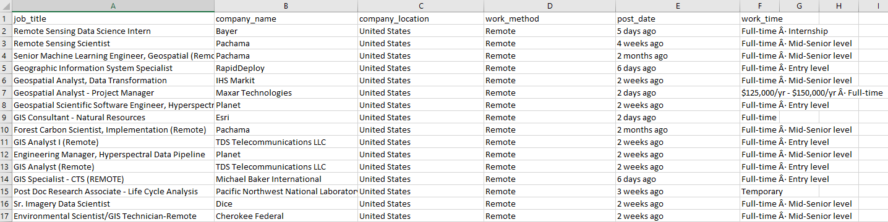

# Web scraper

Web scraper script designed to find available jobs online - Using Google webdriver and Selenium.
It produces a CSV document with all titles and relevant details and a seperate document with descriptions.

This code is lifted from https://medium.com/@kurumert/web-scraping-linkedin-job-page-with-selenium-python-e0b6183a5954 and updated with newer XPath links to match LinkedIn newest update. 
